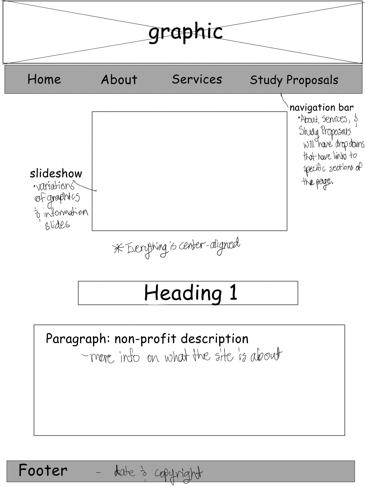
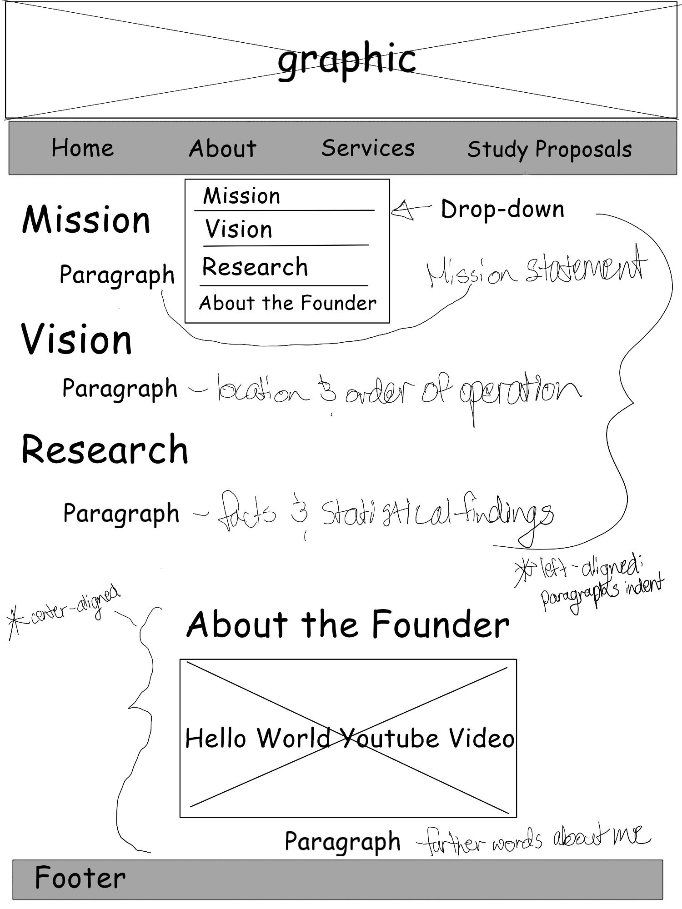
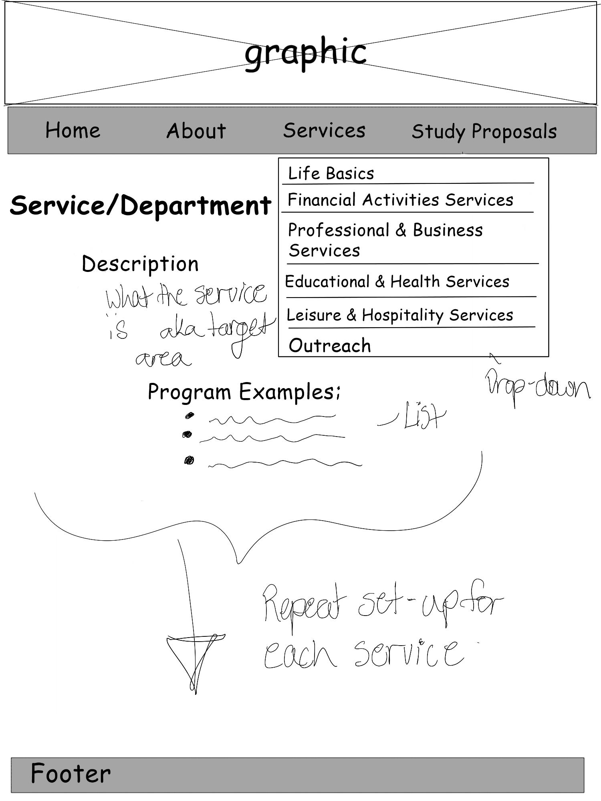
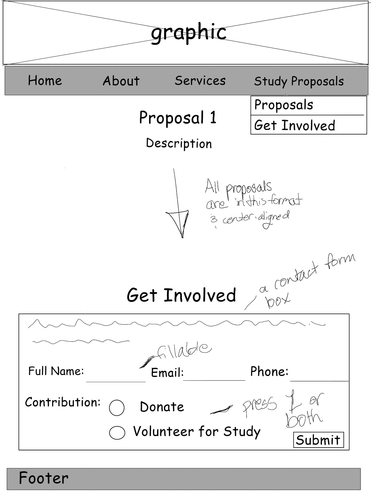

# Maia Morgan's INF 6420 Project

A non-profit proposal site for my idea.

## Wireframes

Header - will include a graphic that is a banner at very top of site and my navigation menu

Navigation Menu - will include links to other pages like a contact form which includes the drop-down menu links associated with the About, Services, and Study Proposals tabs

Main Content - will include slideshow of a few graphics and information slides on new developments and underneath it will include a description of the purpose of the website and a brief overview of the non-profit

Footer - will include copyright information

Header - will include a graphic that is a banner at very top of site and my navigation menu

Navigation Menu - will include links to other pages like a contact form which includes the drop-down menu links associated with the About, Services, and Study Proposals tabs

Main Content - will include section on the mission statement, a section on the vision for the non-profit, a section on the research conducted, and a section that involved the Hello World youtube video and underneath a paragraph on myself and how I came up with this proposal

Footer - will include copyright information

Header - will include a graphic that is a banner at very top of site and my navigation menu

Navigation Menu - will include links to other pages like a contact form which includes the drop-down menu links associated with the About, Services, and Study Proposals tabs

Main Content - will include the service or department name and the description as well as program examples the service may conduct

Footer - will include copyright information

Header - will include a graphic that is a banner at very top of site and my navigation menu

Navigation Menu - will include links to other pages like a contact form which includes the drop-down menu links associated with the About, Services, and Study Proposals tabs

Main Content - will include the service or department name and the description as well as program examples the service may conduct

Footer - will include copyright information
